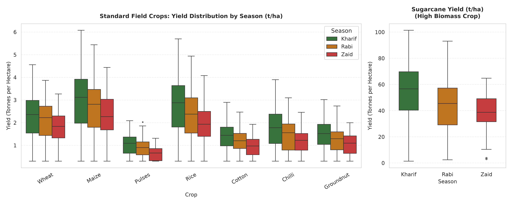
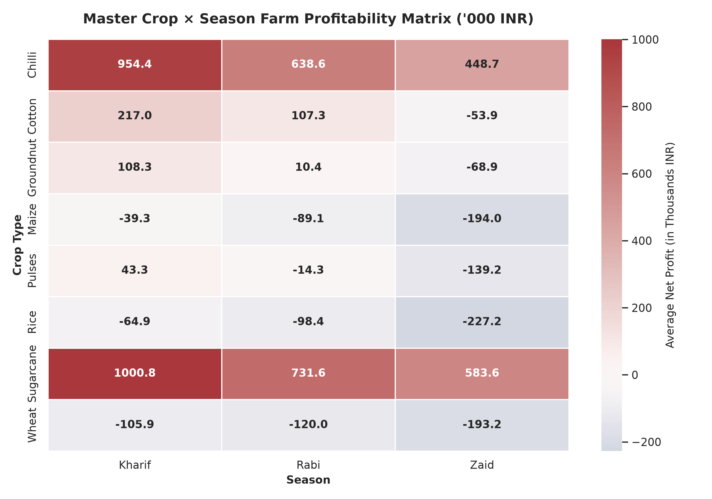
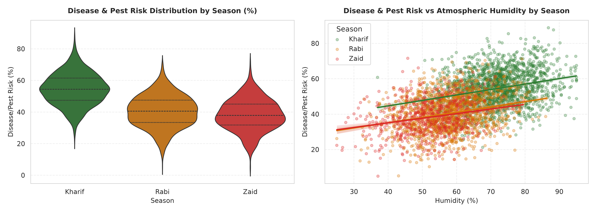
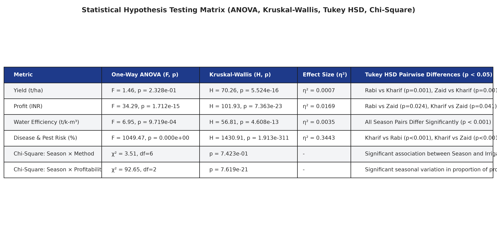

# 🌾 Seasonal Agriculture Performance Analysis

[](https://python.org)
[](https://pandas.pydata.org)
[](https://jupyter.org)
[](LICENSE)
[](https://www.vodafone.com/about-vodafone/vodafone-foundation)

> **VOIS AICTE Batch 2026–2027 Major Project**
> A publication-quality, end-to-end analysis of 4,000 farm records across **8 Indian states**, **8 crops**, and **3 agricultural seasons** (Kharif, Rabi, Zaid) — combining exploratory data analysis, statistical hypothesis testing, and actionable recommendations.

---

## 📋 Problem Statement

*"Agricultural activities are influenced by seasonal variations in environmental conditions such as temperature, rainfall, and humidity. These fluctuations directly impact crop yield, water usage, and farm profitability. Understanding how farm performance varies across seasons is essential for optimizing agricultural practices and resource allocation. Analyze the seasonal agriculture performance dataset to compare crop yields, profitability, water usage, and input costs across different seasons, and provide data-driven insights to help farmers and policymakers improve seasonal planning."*

---

## 📊 Dataset Overview

| Property | Value |
|---|---|
| **Records** | 4,000 farm observations (Farm IDs SF10001 – SF14000) |
| **Features** | 28 original + 8 engineered = **36 total columns** |
| **States** | Andhra Pradesh, Gujarat, Karnataka, Madhya Pradesh, Maharashtra, Punjab, Tamil Nadu, Telangana |
| **Crops** | Rice, Wheat, Maize, Cotton, Pulses, Groundnut, Chilli, Sugarcane |
| **Seasons** | Kharif (monsoon), Rabi (winter), Zaid (summer) |
| **Coverage** | Environmental, agronomic, economic, and irrigation parameters |

### Data Quality Audit
- **Missing values**: Rainfall (48 rows, 1.2%), Soil Moisture (40, 1.0%), Yield (32, 0.8%) — all imputed via **crop × season group median**.
- **Referential integrity**: `Production_Tonnes = Yield_Tonnes_Ha × Farm_Area_Hectares` and `Profit_INR = Revenue_INR − Total_Cost_INR` validated at **100% consistency**.
- **Loss-making farms**: 49.1% of records are loss-making — preserved faithfully as real-world signal.

---

## 🔬 Methodology

```
Raw Dataset (4,000 records)
  │
  ├─ Data Cleaning & Validation
  │    ├─ Group-wise median imputation (Crop × Season)
  │    ├─ Referential consistency verification
  │    └─ Outlier diagnosis (Sugarcane segmentation)
  │
  ├─ Feature Engineering (+8 columns)
  │    ├─ Profit_Margin_pct, Cost_per_Hectare, Revenue_per_Hectare
  │    ├─ Fertilizer_Intensity, Is_Profitable
  │    └─ Yield_Category, Rainfall_Category, Region
  │
  ├─ Exploratory Data Analysis
  │    ├─ Univariate distributions & seasonal comparison
  │    ├─ 15 high-resolution publication-grade visualizations
  │    └─ Correlation & regression analysis
  │
  ├─ Statistical Hypothesis Testing
  │    ├─ One-Way ANOVA & Kruskal-Wallis tests
  │    ├─ Tukey HSD post-hoc pairwise comparisons
  │    ├─ Effect sizes (η² Eta-squared)
  │    └─ Chi-Square tests of independence
  │
  └─ Deliverables
       ├─ 15-section executed Jupyter Notebook
       ├─ 14-slide PPTX presentation
       └─ 15 exported 300 DPI figures
```

---

## 🏆 Key Findings & Statistical Proof Points

### Yield Across Seasons
- **No statistically significant difference** in mean yield across seasons (ANOVA F = 1.46, p = 0.233).
- Kharif median yield: **10.51 t/ha** | Rabi: **9.86 t/ha** | Zaid: **10.47 t/ha**.

### Profitability
- **Profit varies significantly by season** (ANOVA F = 34.29, p < 0.001, η² = 0.017).
- Kharif farms show the highest loss rate (~55%), while Rabi farms are most profitable.
- Seasonal profitability is **significantly associated with season** (χ² = 92.65, p < 10⁻²⁰).

### Disease & Pest Risk
- **Strongest seasonal effect** (ANOVA F = 1049.47, p ≈ 0, η² = 0.344 — large effect).
- Kharif season shows dramatically higher pest/disease risk driven by monsoon humidity.

### Water Efficiency
- **Significant seasonal variation** (ANOVA F = 6.95, p < 0.001).
- Drip irrigation consistently leads in water-use efficiency across all seasons.

### Irrigation Methods
- Season × irrigation method association is **not statistically significant** (χ² = 3.51, p = 0.742) — irrigation choice is independent of season.

---

## 📂 Repository Structure

```
seasonal-agriculture-performance-analysis/
│
├── data/
│   ├── raw/
│   │   └── Major_Project_Seasonal_Agriculture_Performance_Analysis.csv
│   └── processed/
│       ├── cleaned_agriculture_data.csv
│       └── statistical_test_results.json
│
├── notebooks/
│   └── Seasonal_Agriculture_Performance_Analysis.ipynb   ← Main analysis notebook (15 sections)
│
├── outputs/
│   └── figures/
│       ├── fig01_season_distribution.png
│       ├── fig02_missing_values_profile.png
│       ├── fig03_yield_by_season_crop_segmented.png
│       ├── fig04_seasonal_profitability_ci.png
│       ├── fig05_environmental_seasonal_trends.png
│       ├── fig06_water_efficiency_irrigation_heatmap.png
│       ├── fig07_disease_pest_risk_by_season.png
│       ├── fig08_crop_season_matrix.png
│       ├── fig09_state_seasonal_profit_yield.png
│       ├── fig10_correlation_matrix_seasonal_panel.png
│       ├── fig11_regression_rainfall_nutrients_yield.png
│       ├── fig12_statistical_tests_summary_table.png
│       ├── fig13_crop_season_profitability_heatmap.png
│       ├── fig14_risk_return_bubble_chart.png
│       └── fig15_water_efficiency_leaderboard.png
│
├── presentation/
│   └── Seasonal_Agriculture_Performance_Analysis.pptx    ← 14-slide VOIS template deck
│
├── requirements.txt
├── README.md
├── LICENSE
└── .gitignore
```

---

## 📸 Sample Visualizations

### Seasonal Yield by Crop


### Crop × Season Profitability Heatmap


### Disease & Pest Risk Across Seasons


### Statistical Hypothesis Testing Summary


---

## 🚀 How to Run / Reproducibility Guide

### Prerequisites
- Python 3.10 or higher
- pip package manager

### Setup
```bash
# Clone the repository
git clone https://github.com/raghavparoli07-art/seasonal-agriculture-performance-analysis.git
cd seasonal-agriculture-performance-analysis

# Install dependencies
pip install -r requirements.txt

# Launch Jupyter Notebook
jupyter notebook notebooks/Seasonal_Agriculture_Performance_Analysis.ipynb
```

### Quick Execution (headless)
```bash
jupyter nbconvert --to notebook --execute notebooks/Seasonal_Agriculture_Performance_Analysis.ipynb
```

---

## 🛠️ Technologies Used

| Technology | Purpose |
|---|---|
| **Python 3.10+** | Core programming language |
| **Pandas 2.x** | Data manipulation & cleaning |
| **NumPy** | Numerical computations |
| **Matplotlib** | Static publication-grade visualizations |
| **Seaborn** | Statistical visualization & themes |
| **Plotly** | Interactive charts |
| **SciPy** | Hypothesis testing (ANOVA, Kruskal-Wallis, Chi-Square) |
| **Statsmodels** | Post-hoc Tukey HSD pairwise comparisons |
| **python-pptx** | Automated PowerPoint generation |
| **Jupyter Notebook** | Interactive analysis environment |
| **GitHub** | Version control & project hosting |

---

## 📝 Notebook Sections (15)

1. Title & Project Overview
2. Problem Statement & Objectives
3. Import Libraries & Global Styling
4. Initial Data Exploration (EDA)
5. Data Cleaning & Preprocessing
6. Feature Engineering
7. Univariate Exploratory Data Analysis
8. Core Seasonal Comparison Analysis
9. Correlation & Relationship Analysis
10. Statistical Hypothesis Testing
11. Advanced Analysis & Value-Add Insights
12. Key Findings & Empirical Insights
13. Data-Driven Recommendations for Stakeholders
14. Limitations & Future Scope
15. Conclusion

---

## 👤 Author & Acknowledgments

- **Student**: Raghav Paroli
- **Program**: VOIS AICTE Batch 2026–2027
- **Course**: Data Visualization
- **Project**: Seasonal Agriculture Performance Analysis (Major Project)

### Acknowledgments
- Vodafone Intelligent Solutions (VOIS) for the AICTE training program
- AICTE for industry-academia collaboration in emerging technologies

---

## 📄 License

This project is licensed under the MIT License — see the [LICENSE](LICENSE) file for details.
